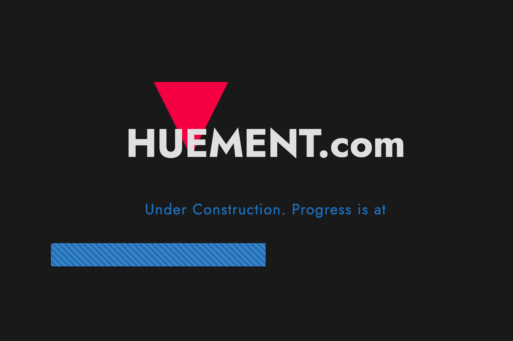
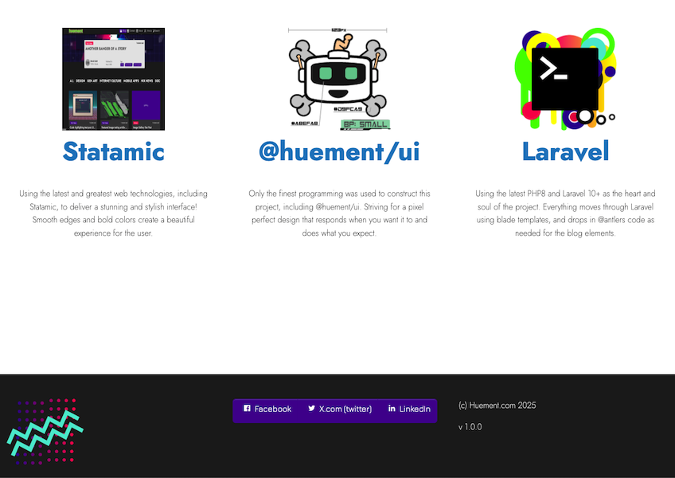

# Preview 🚀



**Preview** is a lightweight and powerful tool for generating stunning previews of your content, files, or applications. Whether you're showcasing code, documents, or media, Preview makes it easy to create visually appealing snapshots with minimal effort.

[](https://github.com/huement/preview/blob/main/LICENSE)
[](https://github.com/huement/preview/stargazers)
[](https://github.com/huement/preview/issues)
[](https://github.com/huement/preview/releases)
[](https://github.com/huement/preview/actions)

## ✨ Features

- **Fast and Lightweight**: Generate previews in seconds without heavy dependencies.
- **Customizable**: Tailor the look and feel of your previews with easy configuration.
- **Cross-Platform**: Works seamlessly on Windows, macOS, and Linux.
- **Extensible**: Integrate with your favorite tools and workflows.
- **Developer-Friendly**: Simple APIs and CLI for automation.

## 📸 Preview

You can also add in detail rows and columns to futher show off what the future project will look like. You can even expand to multiple pages if there is a need.



## 🛠️ Installation

Get started with Preview in just a few steps:

```bash
# Clone the repository
git clone https://github.com/huement/preview.git

# Navigate to the project directory
cd preview

# Install dependencies (example for Node.js-based projects)
npm install

# Run the tool
npm run build
